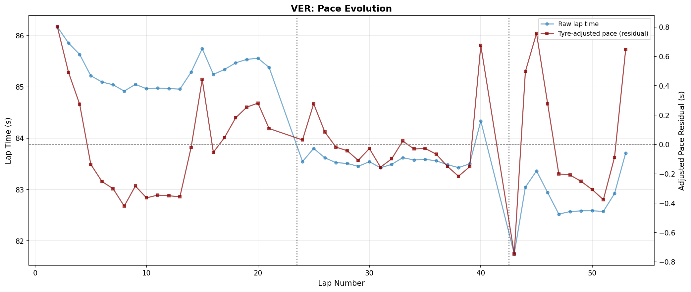
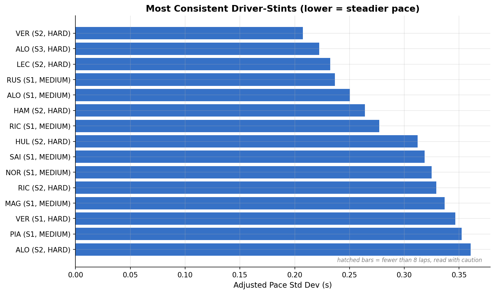
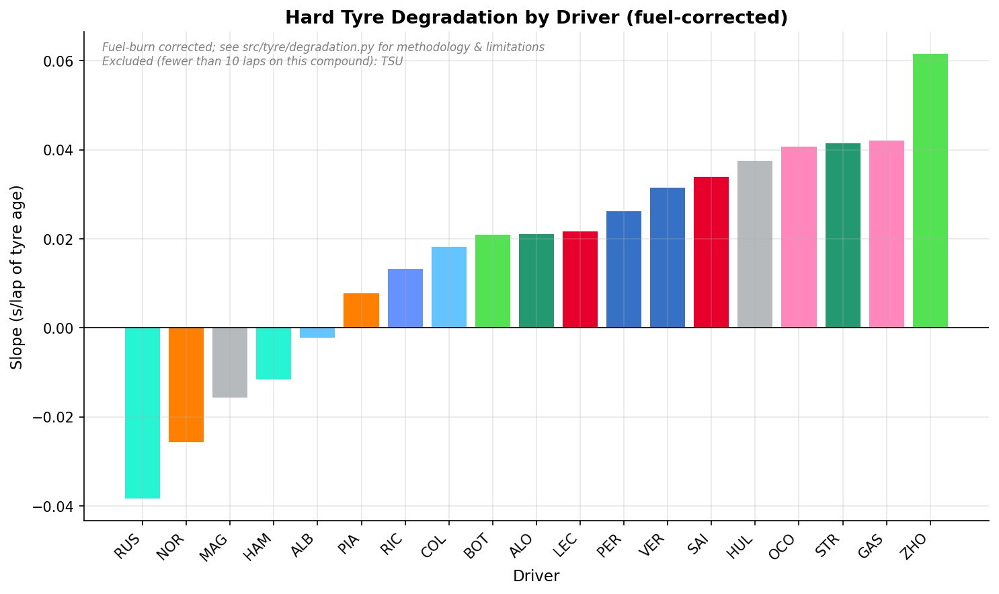
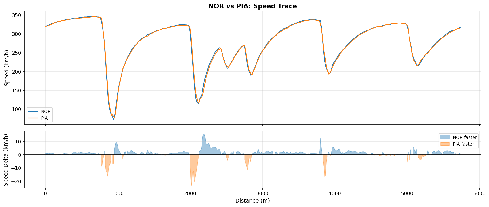
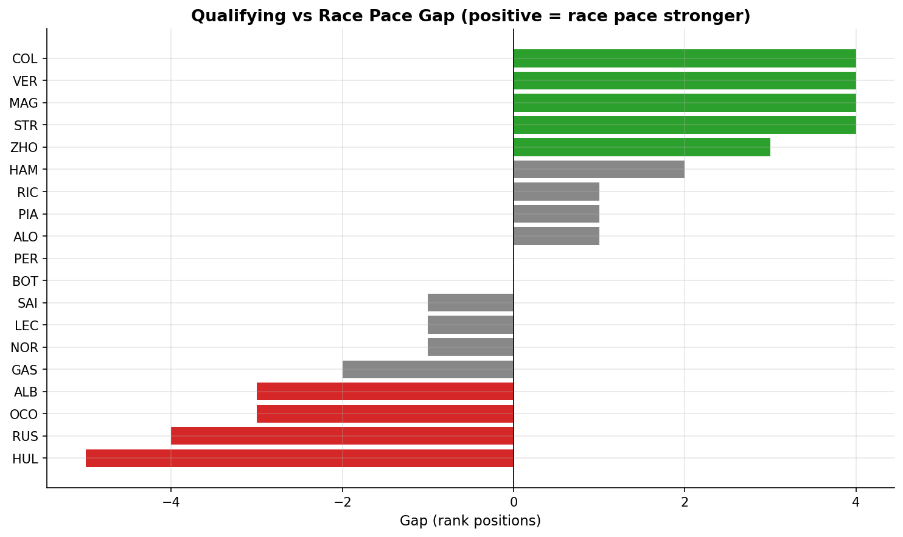
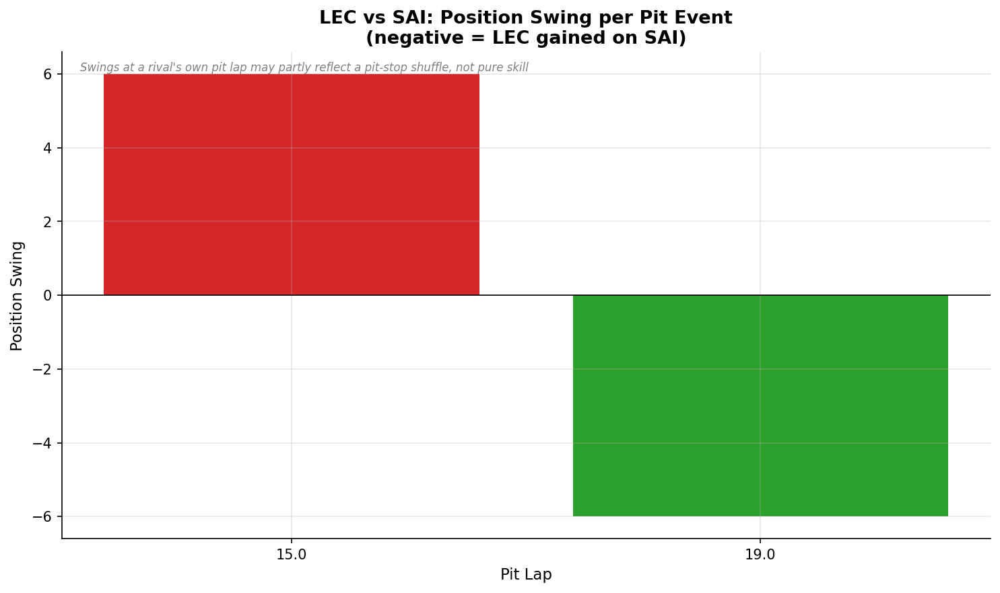

# F1 Driver Performance Analysis

Quantitative analysis of Formula 1 driver and team performance using official
timing and telemetry data via [FastF1](https://github.com/theOehrly/Fast-F1).
Moves past descriptive charts into comparative statistical analysis of racepace, tyre strategy, and qualifying performance built, tested, and debugged against real 2024 race data end to end.

## Sample results

All figures below are generated from real 2024 Italian Grand Prix (Monza)
data by `scripts/generate_figures.py`. Full context for each is in its component section further down.

| | |
|---|---|
|  |  |
|  |  |
|  |  |

## Data source

FastF1 pulls official F1 timing API data: lap times, sector times, car telemetry (speed, throttle, brake, gear, RPM), tyre compound/age, and weather at session and lap-level granularity, across seasons 2023–2025.

**Note:** FastF1 requires live internet access to `livetiming.formula1.com`.
Data pulls must be run in an environment with unrestricted network access (local machine, Colab, CI) — not a sandboxed environment.

## Core analysis components

### 1. Race pace & consistency

Lap time evolution per driver, raw vs. tyre age adjusted pace, and lap time variance (on the tyre-adjusted residual, not raw lap time) as a consistency metric separating "did the tyres get slower" from "was the driver inconsistent."


**Finding:** VER's second (HARD) stint was the most consistent driver-stint in the field at Monza 2024. The sharp spikes in the pace-evolution chart are not tyre wear they line up with traffic/safety-car periods, distinguishable from genuine degradation because degradation shows as a smooth trend, not a
spike and recover pattern. Stints under 8 laps are hatched in the ranking chart rather than mixed in with reliable, full-length stints.

### 2. Tyre degradation modeling

Regression-fit degradation curves (lap time vs. tyre age) per compound per driver, with a fuel burn correction applied.


**Finding — and the most important bug caught in this project:** FastF1 has
no fuel-mass channel, and raw lap time mixes two opposite effects: tyres getting slower with age, and the car getting lighter (faster) as fuel burns off. Uncorrected, fuel dominated: two-thirds of fitted stints in initial testing showed lap times *improving* with tyre age, which isn't a plausible tyre story. A standard ~0.03 sec/kg/lap fuel correction was applied, which fixed about a third of the negative-slope cases; the rest is disclosed as a known, unresolved limitation (likely track evolution) rather than tuned away — see `src/tyre/degradation.py` docstring. TSU's 5-lap stint is excluded from the chart entirely (disclosed in the caption) since a single short stint's extreme slope compressed every other driver's bar into an unreadable line.

### 3. Telemetry driving-style comparison

Distance-aligned speed/throttle/brake traces between two drivers on a common lap (teammate comparisons) — telemetry sampling is irregular (~3.8 Hz, not
fixed-rate), so both drivers' traces are interpolated onto a shared distance grid before comparison.


**Finding:** NOR and PIA (McLaren teammates, 2024 Monza qualifying) were within 0.1s of each other and the detailed trace confirms why — top speed within 1 km/h, braking points within a few meters at most corners, several identical to the meter. A useful sanity check: two teammates in the same car showing near-identical numbers is what correct output should look like.

### 4. Qualifying vs. race pace gap

Delta between qualifying rank and race pace rank per driver, classifying "qualifying specialists" vs "race-day specialists". Uses median raw race lap time by default rather than tyre-adjusted pace — see `RACE_PACE_METHODOLOGY_NOTE` in `src/quali_race_gap/gap_analysis.py` for the reasoning and the stricter alternative.


**Finding:** drivers with fewer than 10 clean race laps (early retirements/DNFs) are excluded from this ranking entirely rather than ranked on an unrepresentative handful of laps — found after TSU's 5-lap retirement initially produced a large, misleading "qualifying specialist" gap that had nothing to do with his actual pace.

### 5. Strategy outcome analysis

Scores the undercut/overcut mechanism against a specific rival using actual pit lap and track position data. This does **not** simulate a full alternative race (no traffic/safety-car modeling) — it measures track-position swaps around real pit events, a narrower but directly answerable question. See the scope note in `src/strategy/strategy_analysis.py`.


**Finding:** a striking position swing can partly reflect a pit-stop shuffle (whoever's left on track while a rival pits briefly looks like they've "gained" track position) rather than pure strategy skill confirmed against 2024 Monza, where PIA's real 16-lap race lead briefly passed to SAI purely because PIA had just pitted. Verified by cross-checking against the actual race leader-by-lap, not assumed.

## Project structure

```
f1-driver-performance-analysis/
├── configs/
│   └── config.yaml          # seasons, sessions, required columns/channels
├── data/
│   ├── raw/                 # untouched FastF1 pulls (gitignored)
│   ├── processed/           # cleaned/derived datasets (gitignored)
│   └── cache/                # FastF1 cache dir (gitignored)
├── notebooks/                 # (empty - scoping was done via scripts/scope_inspect_*.py instead)
├── src/
│   ├── data/                # FastF1 loading, caching, session fetch helpers
│   ├── pace/                # component 1: race pace & consistency
│   ├── tyre/                # component 2: degradation modeling
│   ├── telemetry/           # component 3: driving style comparison
│   ├── quali_race_gap/      # component 4: qualifying vs race gap
│   ├── strategy/            # component 5: strategy outcome analysis
│   └── utils/                # shared helpers (alignment, stats, plotting)
├── scripts/                  # standalone runnable scripts (data pulls, etc.)
├── reports/
│   └── figures/              # generated plots (6 core figures committed, rest gitignored)
├── tests/                     # pytest unit tests (regression guards for real bugs found)
├── requirements.txt
└── README.md
```

## Setup

```bash
python -m venv venv
source venv/bin/activate          # Windows: venv\Scripts\activate
pip install -r requirements.txt
```

To regenerate the figures shown above from live data:

```bash
python scripts/generate_figures.py
```

## Testing

Two layers of testing exist, and they check different things:

- `tests/` — automated pytest unit tests against small, hand-built fake
  data with known-correct answers. Fast (well under a second), no
  network needed, run with `pytest tests/ -v`. These are regression
  guards for the real bugs found during development (the fuel-burn
  confound in tyre degradation, low-sample-stint flagging, the
  qualifying-vs-race pace exclusion rule, telemetry interpolation math)
  — each test's docstring explains which bug it guards against.
- `scripts/test_*.py` — manual smoke tests against real FastF1 data
  (2024 Monza, Spa, etc.). These require network access and a human to
  read the printed output and judge whether it looks right; this is how
  the bugs the pytest suite now guards against were originally found.

## Status

Data scoping is complete — real 2023-2024 sessions (clean and wet/chaotic races, qualifying and race, multiple seasons) were inspected before any analysis component was written; see `scripts/scope_inspect_session.py`, `scope_inspect_quali_and_seasons.py`, and `scope_inspect_results.py` for the scripts used and their findings (schema stability, the `IsAccurate` flag, qualifying data living in `session.results` not `session.laps`, etc.), which are also summarized in each module's docstring where relevant(eg. `src/data/loader.py`). All 5 core components are built, tested against real data, and covered by an automated regression suite.